# Class Diagram — CampusOS

## Overview
This class diagram shows the major classes, their attributes, methods, and relationships across the CampusOS platform. The design follows **Clean Architecture** principles (Controller → Service → Repository) with strong **OOP principles** and **design patterns** to ensure modularity and scalability.

```mermaid
classDiagram
    namespace Infrastructure {
        class DatabaseProvider {
            +connect()
            +query(sql: string)
            +transaction(callback: Function)
        }
        class KafkaEventBus {
            +publish(topic: string, message: json)
            +subscribe(topic: string, handler: Function)
        }
        class RedisManager {
            +cache(key: string, value: any, ttl: int)
            +invalidate(key: string)
        }
    }

    namespace Auth_Module {
        class AuthController {
            -authService: IAuthService
            +login(req: Request, res: Response)
            +signup(req: Request, res: Response)
            +logout(req: Request, res: Response)
        }
        class IAuthService {
            <<interface>>
            +authenticate(credentials)
            +generateJWT(user)
            +validateToken(token)
        }
        class AuthService {
            -userRepo: IUserRepository
            -hasher: PasswordHasher
            +authenticate(credentials)
            +generateJWT(user)
        }
        class IUserRepository {
            <<interface>>
            +findByEmail(email)
            +save(user)
        }
    }

    namespace Academic_Module {
        class AttendanceController {
            -attendanceService: IAttendanceService
            +markPresent(req: Request)
            +getStudentReport(req: Request)
        }
        class IAttendanceService {
            <<interface>>
            +recordAttendance(data)
            +calculatePecentage(studentId)
        }
        class AttendanceService {
            -attendanceRepo: IAttendanceRepo
            -eventBus: KafkaEventBus
            +recordAttendance(data)
        }
        class IAttendanceRepo {
            <<interface>>
            +saveRecord(record)
            +getHistory(studentId)
        }
    }

    namespace Notification_Module {
        class NotificationObserver {
            -kafka: KafkaEventBus
            -providers: INotificationProvider[]
            +onMessage(event)
            +dispatch(userId, msg)
        }
        class INotificationProvider {
            <<interface>>
            +send(userId, content)
        }
        class EmailProvider { +send(userId, content) }
        class PushProvider { +send(userId, content) }
    }

    %% Relationships
    AuthController o-- IAuthService : holds
    AuthService ..|> IAuthService : implements
    AuthService o-- IUserRepository : uses
    
    AttendanceController o-- IAttendanceService : holds
    AttendanceService ..|> IAttendanceService : implements
    AttendanceService o-- IAttendanceRepo : uses
    AttendanceService o-- KafkaEventBus : publishes to

    NotificationObserver o-- KafkaEventBus : listens to
    NotificationObserver o-- INotificationProvider : manages
    EmailProvider ..|> INotificationProvider : implements
    PushProvider ..|> INotificationProvider : implements

    %% Patterns
    class Singleton_DB { <<singleton>> }
    class Factory_Notification { <<factory>> }
```

## Design Patterns in the Class Diagram

| Pattern | Usage |
| :--- | :--- |
| **Singleton** | Ensures a single instance of `DatabaseProvider` and `RedisManager` across all services. |
| **Factory Method** | Used to instantiate the correct `INotificationProvider` (Email vs Push) based on user settings. |
| **Observer** | The `NotificationObserver` listens to inter-service events (via Kafka) to trigger real-time alerts. |
| **Dependency Injection** | interfaces like `IAuthService` and `IAttendanceRepo` allow swapping implementations (e.g., Mocking for Tests). |
| **Strategy Pattern** | Used in `AttendanceService` to apply different attendance policies (e.g., standard vs medical leave). |
| **Repository Pattern** | Abstracting data storage logic, allowing the business layer to remain data-source agnostic. |
