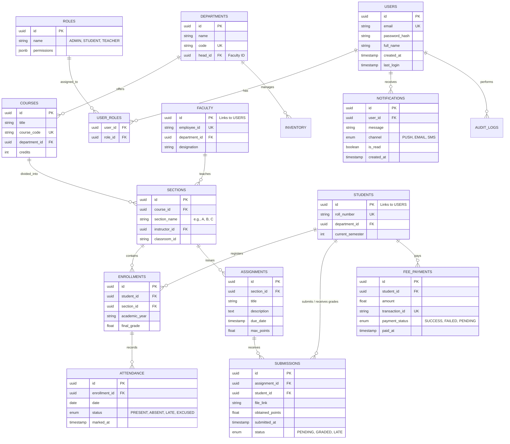

# ER Diagram — CampusOS

## Overview
This Entity-Relationship diagram shows the comprehensive database schema for the CampusOS platform. It covers all core university operations, including user management, academic structuring, attendance tracking, and financial transactions. All tables, columns, types, and relationships are defined below to ensure a scalable and robust data model.

## Table Descriptions

| Entity | Description | Core Responsibility |
| :--- | :--- | :--- |
| **USERS** | Core identity table. | Authentication and identity management. |
| **DEPARTMENTS** | University departments. | Organizational unit management. |
| **COURSES** | Academic subjects. | Curriculum definition. |
| **SECTIONS** | Specific instances of courses. | Scheduling and instructor assignment. |
| **ENROLLMENTS** | Student-Course mapping. | Registration and grading. |
| **FEE_PAYMENTS** | Financial records. | Revenue and fee tracking. |
| **NOTIFICATIONS** | Messaging system. | Real-time user alerting. |
