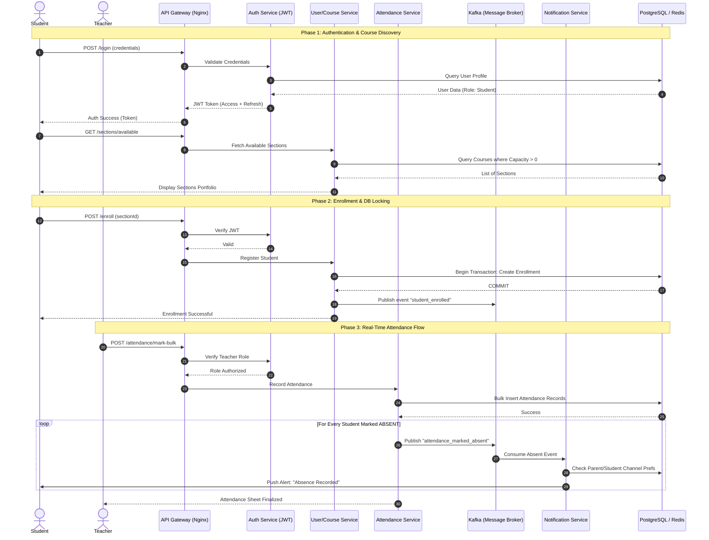

# Sequence Diagram — CampusOS

## Main Flow: End-to-End Course Enrollment & Real-Time Presence Verification

This sequence diagram illustrates the complete lifecycle of a student's entry into a course—from registration and section assignment to their first attendance mark and the resulting AI-driven notification system.

## System Interconnectivity Breakdown

| Step | Action | Service Responsibility |
| :--- | :--- | :--- |
| **Auth** | JWT Validation | `Auth Service` ensures that only registered users can access the Gateway. |
| **Transaction** | Database Locking | `User/Course Service` uses ACID transactions to prevent section over-enrollment. |
| **Event Bus** | Kafka Pub/Sub | `Attendance Service` remains non-blocking by offloading notifications to Kafka. |
| **Worker** | Consumer Logic | `Notification Service` operates asynchronously, optimizing throughput. |
| **Caching** | Redis Hits | `Auth Service` caches session tokens in Redis to minimize PostgreSQL hits. |
